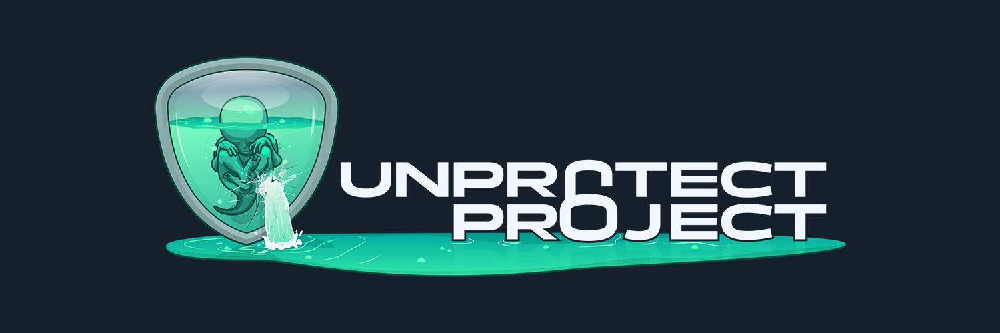

# Snippets

> Repository that will hold all my code snippet / small project releases.

# Disclaimer

🇺🇸 All source code and projects shared on this Github account by Jean-Pierre LESUEUR and his company, PHROZEN SAS, are provided "as is" without warranty of any kind, either expressed or implied. The user of this code assumes all responsibility for any issues or legal liabilities that may arise from the use, misuse, or distribution of this code. The user of this code also agrees to release Jean-Pierre LESUEUR and PHROZEN SAS from any and all liability for any damages or losses that may result from the use, misuse, or distribution of this code.

By using this code, the user agrees to indemnify and hold Jean-Pierre LESUEUR and PHROZEN SAS harmless from any and all claims, liabilities, costs, and expenses arising from the use, misuse, or distribution of this code. The user also agrees not to hold Jean-Pierre LESUEUR or PHROZEN SAS responsible for any errors or omissions in the code, and to take full responsibility for ensuring that the code meets the user's needs.

This disclaimer is subject to change without notice, and the user is responsible for checking for updates. If the user does not agree to the terms of this disclaimer, they should not use this code.

---

🇫🇷 Tout les codes sources et les projets partagés sur ce compte Github par Jean-Pierre LESUEUR et sa société, PHROZEN SAS, sont fournis "tels quels" sans aucune garantie, expresse ou implicite. L'utilisateur de ce code assume toute responsabilité pour les problèmes ou les responsabilités juridiques qui pourraient résulter de l'utilisation, de l'utilisation abusive ou de la diffusion de ce code. L'utilisateur de ce code accepte également de libérer Jean-Pierre LESUEUR et PHROZEN SAS de toute responsabilité pour tous dommages ou pertes pouvant résulter de l'utilisation, de l'utilisation abusive ou de la diffusion de ce code.

En utilisant ce code, l'utilisateur accepte de garantir et de dégager Jean-Pierre LESUEUR et PHROZEN SAS de toutes réclamations, responsabilités, coûts et dépenses résultant de l'utilisation, de l'utilisation abusive ou de la diffusion de ce code. L'utilisateur accepte également de ne pas tenir Jean-Pierre LESUEUR ou PHROZEN SAS responsable des erreurs ou omissions dans le code et de prendre l'entière responsabilité de s'assurer que le code répond aux besoins de l'utilisateur.

Cette clause de non-responsabilité est sujette à modification sans préavis et l'utilisateur est responsable de vérifier les mises à jour. Si l'utilisateur n'accepte pas les termes de cette clause de non-responsabilité, il ne doit pas utiliser ce code.

## 🌳 Project Tree

### General

  

[Visit Official Phrozen Website](https://www.phrozen.io)

* Delphi
	* [SelectFilesOnExplorer](Delphi/SelectFilesOnExplorer/)
	* [UntEnumDLLExport.pas](Delphi/UntEnumDLLExport.pas)
	* [GetProcAddress_ALT_Example](Delphi/GetProcAddress_ALT_Example.pas)
	* [GetProcessName_Method1](Delphi/GetProcessName_Method1.pas)
	* [GetProcessName_Method2](Delphi/GetProcessName_Method2.pas)
	* [GetProcessName_Method2_Remote](Delphi/GetProcessName_Method2_Remote.pas)
	* [GetProcessName_Method3](Delphi/GetProcessName_Method3.pas)
	* [GetProcessName_Method4](Delphi/GetProcessName_Method4.pas)
	
* Python
	* [ExtractStrings.py](Python/ExtractStrings.py)
	* [malinx.py](Python/malinx.py)

* CSharp (C#)
	* [CheckExplorerExeExtensions.cs](CS/CheckExplorerExeExtensions.cs)

---

### Unprotect

  

[Visit Official Unprotect Website](https://unprotect.it)

* Delphi
	* [APCRun](Unprotect/Delphi/APCRun.dpr)
	* [APCInjector](Unprotect/Delphi/APCInjector.dpr)
	* [RunPE](Unprotect/Delphi/RunPE.dpr)
	* [ProcEnvInjection_DLLInjection](Unprotect/Delphi/ProcEnvInjection_DLLInjection.dpr)
	* [DLLInjection_CreateRemoteThread_LoadLibrary](Unprotect/Delphi//DLLInjection_CreateRemoteThread_LoadLibrary.dpr)
	* [DetectMouseMove](Unprotect/Delphi/DetectMouseMove.dpr)
	* [NtQueryProcessInformation](Unprotect/Delphi/NtQueryProcessInformation.dpr)
	* [Melt](Unprotect/Delphi/Melt.dpr)
	* [AntiSandboxScanService](Unprotect/Delphi/AntiSandboxScanService.dpr)
	* [UntDataStreamObject](Unprotect/Delphi/UntDataStreamObject.pas)
	* [NtQueryObject](Unprotect/Delphi/NtQueryObject.dpr)
	* [ADB_NtSetInformationThread](Unprotect/Delphi/ADB_NtSetInformationThread.dpr)
	* [IsDebuggerPresent](Unprotect/Delphi/IsDebuggerPresent.dpr)
	* [NtSetDebugFilterState](Unprotect/Delphi/NtSetDebugFilterState.dpr)
	* [OutputDebugString](Unprotect/Delphi/OutputDebugString.dpr)
	* [SuspendThread](Unprotect/Delphi/SuspendThread.dpr)
	* [FindWindowAPI](Unprotect/Delphi/FindWindowAPI.dpr)
	* [UntPEBDebug](Unprotect/Delphi/UntPEBDebug.pas)
	* [FtpC2](Unprotect/Delphi/FtpC2.pas)

* C#
	* [Timestomp](Unprotect/CS/Timestomp.cs)
	* [Melt](Unprotect/CS/Melt.cs)
	* [DetectMacAddress](Unprotect/CS/DetectMacAddress.cs)
	* [NtQueryInformationProcess](Unprotect/CS/NtQueryInformationProcess.cs)
	* [FtpC2](Unprotect/CS/FtpC2.cs)

* Python
	* [CodeCaveHelper](Unprotect/Python/CodeCaveHelper.py)
	* [FindWindow](Unprotect/Python/FindWindow.py)
